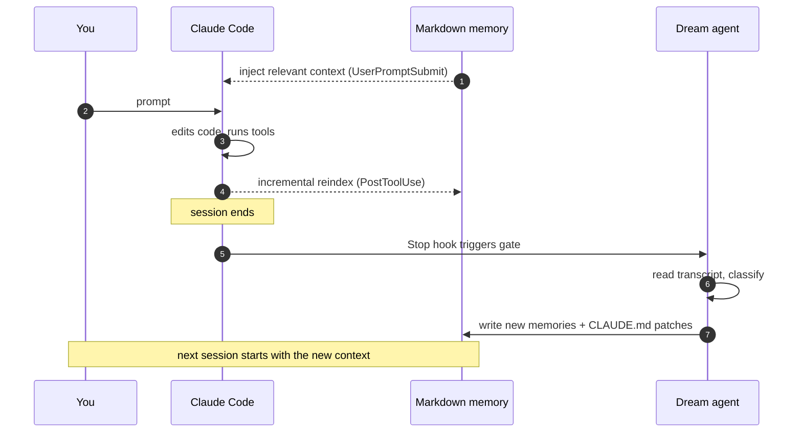

# Somnium

[](LICENSE)
[](https://www.python.org/downloads/)
[](#testing)

> A long-term memory and dream loop for Claude Code.

Somnium turns Claude Code into something that **remembers**. After every
session, a small Claude sub-agent reads the transcript and writes down what
was worth keeping — your conventions, your "we always do X here" rules, the
quirks of the project you just touched. The next time you open Claude Code,
the relevant pieces are already in context before you type your first prompt.

It also gives Claude a real semantic search over your memories *and* your
code, exposed as MCP tools.



---

## Quick start

```bash
pipx install claude-somnium

export VOYAGE_API_KEY=pa-...    # https://voyageai.com (free tier OK)

somnium init                    # global setup + register hooks + MCP server
cd my-project && somnium init --project   # opt this repo into project memory
somnium index --code            # (optional) build a semantic index of the repo
```

That's it. Open Claude Code anywhere and the memory + dream loop runs automatically.

## What you get

- **Persistent memory across sessions.** Markdown files indexed by Voyage
  AI embeddings. The index is a derivable cache — your `.md` files are
  the source of truth, version them with git like everything else.
- **A dream loop after every session.** A detached Claude sub-agent
  reviews what just happened and writes down preferences, conventions,
  and `CLAUDE.md` patches automatically. Skips trivial sessions
  ("commit this", short Q&A) so you don't burn tokens on nothing.
- **Auto-injected context on every prompt.** A `UserPromptSubmit` hook
  searches your memory before Claude even sees the prompt and attaches
  the most relevant chunks, bounded by a token budget.
- **Semantic code search.** Per-project index built on demand with
  `voyage-code-3`. Exposed as the `code_search_semantic` MCP tool so
  Claude can use it instead of grepping blindly.

## Example: a typical session

You're refactoring a React project. Halfway through you tell Claude:

> "Actually, shared components live in `src/components/shared/` from now
> on, and feature components go under `src/features/<name>/`."

Claude does the refactor, you move on, you quit.

The Stop hook fires. The dream gate sees a real implementation
conversation (file writes + a stated preference, not just "commit this")
and dispatches a background sub-agent. ~20 seconds and ~$0.10 later:

```
my-project/
├── CLAUDE.md                           # ← one-line patch appended
└── .claude/somnium/memory/
    └── 2026-04-10-react-component-layout.md   # ← new file
```

Both are real files you can `git diff`, accept, or revert.

A week later you start a new session in that repo and type *"add a Modal
component"*. Before Claude sees the prompt, the `UserPromptSubmit` hook
has already searched your memory, found the layout convention, and
injected it. Claude knows where the file belongs without being re-told.

## MCP tools available to Claude

| Tool | What it does |
|------|--------------|
| `memory_search(query, scope, top_k)` | Semantic search across global, project, and skill memories. |
| `memory_write(content, scope, title, tags)` | Append a memory mid-session and auto-reindex it. |
| `memory_status()` | Health snapshot — counts, scopes, dream state. |
| `code_search_semantic(query, top_k)` | Natural-language search over the project's source code. |

## Memory scoping

- **Global memory** lives in `~/.claude/somnium/memory/` and applies to
  every project (e.g. *"always use Graphite to push branches"*).
- **Project memory** lives in `<repo>/.claude/somnium/memory/` and is
  scoped to that repo (e.g. *"shared components go in `src/components/shared/`"*).

The dream agent decides which scope each new memory belongs to based on
language cues (*"always"* vs *"in this project"*). Both scopes are
queried together at search time.

## CLI reference

```
somnium init [--project] [--force]      create folders, copy config, install hooks
somnium index [--code]                   embed memories and (optionally) source code
somnium reindex                          re-check every file and upsert changes
somnium search "query" [-k 5] [-s scope] debug search from the shell
somnium status                           health snapshot
somnium dream [-t path] [--force]        manually run the dream agent
somnium uninstall [--delete-data]        remove hooks; data is kept by default
```

## Documentation

Deeper guides for each subsystem live in [`docs/`](docs/):

- [**Dream mode**](docs/dream-mode.md) — how the gate decides, what the
  agent does, the per-session digest, full prompt and JSON schema.
- [**Code search**](docs/code-search.md) — building and querying the
  semantic code index, ignore rules, incremental updates.
- [**Configuration**](docs/configuration.md) — every key in
  `config.toml`, per-project overrides, env vars.
- [**Architecture**](docs/architecture.md) — the package layout for
  contributors, plus how the hooks fit together.

## Testing

```bash
pip install -e '.[dev]'
pytest
```

The suite uses a fake embedder so it runs in about a second and costs
nothing. End-to-end runs against the real Voyage API and `claude -p`
are documented in the commit history.

## License

Apache 2.0. Built by [Impulse Studio](https://impulse.studio).
