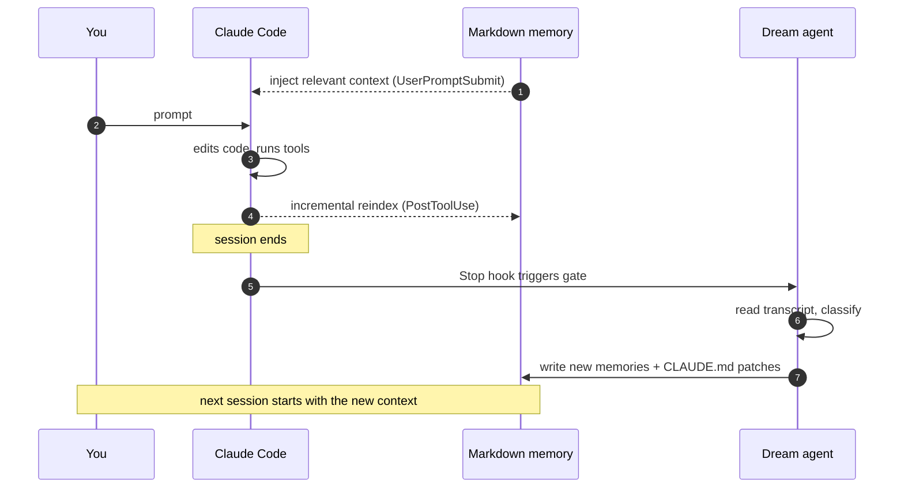

# Somnium

[](LICENSE)
[](https://www.python.org/downloads/)
[](#testing)

> A long-term memory and dream loop for Claude Code.

Somnium turns Claude Code into something that **remembers**. After every
session, a small Claude sub-agent reads the transcript and writes down what
was worth keeping — your conventions, your "we always do X here" rules, the
quirks of the project you just touched. The next time you open Claude Code,
the relevant pieces are already in context before you type your first prompt.

It also gives Claude a real semantic search over your memories *and* your
code, exposed as MCP tools.



---

## Quick start

```bash
# 1. Install the CLI (pick one).
uv tool install claude-somnium       # if you use uv (faster)
pipx install claude-somnium          # traditional alternative

# 2. Drop your Voyage AI key in the env (or in ~/.claude/somnium/config.toml later).
#    Free tier at https://voyageai.com is plenty.
export VOYAGE_API_KEY=pa-...

# 3. One-time setup: creates ~/.claude/somnium/, registers the hooks
#    and the MCP server with Claude Code. You only run this ONCE per machine.
somnium init

# 4. (Optional, per-project) Turn on semantic code search in a repo.
#    Memory and the dream loop work without this step — this is only
#    needed if you want the `code_search_semantic` MCP tool to return
#    hits when Claude asks things like "where do we handle auth".
cd my-project
somnium index --code
```

Steps 1–3 are the entire setup. Open Claude Code in **any git repo** and
Somnium detects it automatically — there is no per-project init step.
Memory, the dream loop, and context injection start working immediately.

Step 4 is opt-in per repo because indexing a codebase costs a few cents
in Voyage credits and not every project benefits from it. Once you've
run it for a repo, the PostToolUse hook keeps the index up to date
automatically as Claude edits files.

Run `somnium status` any time to verify everything is wired up — it
prints every index, every hook, and the MCP connection state in one
shot.

## Updating

```bash
somnium update
```

Detects whether you installed with `uv` or `pipx`, upgrades the
package, and re-registers hooks + MCP server in one shot.

## What you get

- **Persistent memory across sessions.** Markdown files indexed by Voyage
  AI embeddings. The index is a derivable cache — your `.md` files are
  the source of truth, version them with git like everything else.
- **A dream loop after every session.** A detached Claude sub-agent
  reviews what just happened and writes down preferences, conventions,
  and `CLAUDE.md` patches automatically. Skips trivial sessions
  ("commit this", short Q&A) so you don't burn tokens on nothing.
- **Auto-injected context on every prompt.** A `UserPromptSubmit` hook
  searches your memory before Claude even sees the prompt and attaches
  the most relevant chunks, bounded by a token budget.
- **Semantic code search.** Per-project index built on demand with
  `voyage-code-3`. Exposed as the `code_search_semantic` MCP tool so
  Claude can use it instead of grepping blindly.
- **Auto-generated project skills.** When the dream agent spots a
  procedural pattern that's specific to a project ("how to add an API
  endpoint here"), it writes a real Claude Code `SKILL.md` into
  `<repo>/.claude/skills/`. You then invoke it in future sessions with
  `/<slug>` like any other skill.
- **In-place updates, never duplicates.** Memories and skills are
  named by slug only. The next time the dream agent extracts a fact
  about an existing topic, it rewrites the same file rather than
  creating `foo-2.md`, `foo-3.md`, etc.

## Example: a typical session

You're refactoring a React project. Halfway through you tell Claude:

> "Actually, shared components live in `src/components/shared/` from now
> on, and feature components go under `src/features/<name>/`."

Claude does the refactor, you move on, you quit.

The Stop hook fires. The dream gate sees a real implementation
conversation (file writes + a stated preference, not just "commit this")
and dispatches a background sub-agent. ~20 seconds and ~$0.10 later:

```
my-project/
├── CLAUDE.md                                   # ← one-line patch appended
└── .claude/somnium/memory/
    └── react-component-layout.md               # ← new file
```

Both are real files you can `git diff`, accept, or revert. Next time
the dream agent picks up the same topic, it overwrites
`react-component-layout.md` in place rather than creating a duplicate.

A week later you start a new session in that repo and type *"add a Modal
component"*. Before Claude sees the prompt, the `UserPromptSubmit` hook
has already searched your memory, found the layout convention, and
injected it. Claude knows where the file belongs without being re-told.

## MCP tools available to Claude

| Tool | What it does |
|------|--------------|
| `memory_search(query, scope, top_k, tags)` | Semantic search across global, project, and skill memories. Filter by tags. |
| `memory_write(content, scope, title, tags)` | Append a memory mid-session and auto-reindex it. |
| `memory_status()` | Health snapshot — counts, scopes, dream state. |
| `code_search_semantic(query, top_k)` | Natural-language search over the project's source code. |

## Memory scoping

- **Global memory** lives in `~/.claude/somnium/memory/` and applies to
  every project (e.g. *"always use Graphite to push branches"*).
- **Project memory** lives in `<repo>/.claude/somnium/memory/` and is
  scoped to that repo (e.g. *"shared components go in `src/components/shared/`"*).

The dream agent decides which scope each new memory belongs to based on
language cues (*"always"* vs *"in this project"*). Both scopes are
queried together at search time.

## Indexing — when does each index update

Somnium maintains **two separate indexes** with different lifecycles.
You almost never have to think about either one, but it's worth
knowing what's happening behind the scenes.

### Memory index — built and updated automatically

Stored at `~/.claude/somnium/index.duckdb` (global) and
`<repo>/.claude/somnium/index.duckdb` (project). Updated by:

| Trigger | What happens |
|---|---|
| `somnium index` | Full walk of every memory dir, embeds changed files. Manual / one-time. |
| Dream agent (after a Stop hook) | New memories the agent writes are indexed inline before the digest is finalized. |
| `PostToolUse` hook | When Claude writes or edits a `.md` file inside a memory dir, only that file is reindexed. Hash-based, so an unchanged file is a no-op. |
| `memory_write` MCP tool | When Claude calls `memory_write` mid-session, the new file is reindexed inline. |

You almost never need to call `somnium index` by hand — it's a recovery
tool for when you blow away the DuckDB file or edit `.md` files
outside Claude.

### Code index — built on demand, opt-in per project

Stored at `<repo>/.claude/somnium/code-index.duckdb`. The code index
is **only built if you ask for it** — there's no auto-creation, because
embedding a whole codebase costs a few cents per repo and not every
project benefits from semantic code search.

| Trigger | What happens |
|---|---|
| `somnium index --code` | Full repo walk. Chunks every source file (line groups, ~40 lines), embeds with `voyage-code-3`, writes to the per-project DuckDB. |
| `PostToolUse` hook | When Claude writes or edits a source file, that single file is reincremental-reindexed. Only fires if the index already exists. |

If `code_search_semantic` returns an empty list, that's because the
index hasn't been built. Run `somnium index --code` once and Claude
can search code semantically from that point on.

### Verifying everything is wired up

`somnium status` is the doctor command. It shows, in order:

- **Memory indexes** — file/chunk counts for global and project
- **Code index** — same for per-project code, with a "not built" hint
  if you haven't run `somnium index --code` yet
- **Hooks** — every Somnium hook registered in `~/.claude/settings.json`
  with the absolute command path next to each
- **MCP server** — registration status from `claude mcp get somnium`
  (`✓ Connected` if Claude Code can talk to it), the command path,
  and the list of tools exposed
- **Configuration** — Voyage key state, dream model, project root,
  global root

Run it after `somnium init` to verify the install, or any time you
want to know what Somnium knows about.

## Project detection

Somnium considers any directory containing a `.git` folder (or a
pre-existing `.claude/somnium/` marker) as a Somnium project. There is
no separate "register this project" step — Claude Code is launched in
a git repo, the hooks fire, and Somnium creates
`<repo>/.claude/somnium/memory/` lazily on the first write.

If you want to override config per-project (different dream model,
different ignore list, disable a phase, …), drop a
`<repo>/.claude/somnium/project.toml` by hand or run `somnium init --project`
inside the repo to scaffold a commented template. Otherwise you never
need to think about it.

## CLI reference

```
somnium init [--project] [--force]      create folders, config, hooks, slash commands
somnium index [--code]                   embed memories and (optionally) source code
somnium reindex                          re-check every file and upsert changes
somnium search "query" [-k 5] [-s scope] [-t tags]
                                        search memories, skills and code
                                        scopes: all|global|project|skills|code
                                        tags: comma-separated filter (e.g. python,git)
somnium status                           full health snapshot (indexes, hooks, MCP)
somnium dream [-t path] [--force]        manually run the dream agent
somnium memory list [-s scope]           list all memories with scope, tags, date
somnium memory show <slug>               print a memory's full content
somnium memory edit <slug>               open in $EDITOR, reindex on save
somnium memory rm <slug> [-y]            delete a memory
somnium memory move <slug> --to <scope>  move between global and project
somnium memory merge <s1> <s2> [...]     consolidate N memories into one
somnium update [--skip-init]             upgrade to latest + re-register hooks
somnium config get|set|list|path         read/write config without editing TOML
somnium uninstall [--delete-data]        remove hooks; data is kept by default
```

## Slash commands

After `somnium init`, these slash commands are available inside Claude
Code:

- `/somnium:dream` — force the dream agent on the current session
- `/somnium:search <query>` — search your memories from inside Claude
- `/somnium:status` — show the health snapshot

## Documentation

Deeper guides for each subsystem live in [`docs/`](docs/):

- [**Dream mode**](docs/dream-mode.md) — how the gate decides, what the
  agent does, the per-session digest, full prompt and JSON schema.
- [**Code search**](docs/code-search.md) — building and querying the
  semantic code index, ignore rules, incremental updates.
- [**Configuration**](docs/configuration.md) — every key in
  `config.toml`, per-project overrides, env vars.
- [**Skills**](docs/skills.md) — how Somnium creates and updates
  Claude Code skills automatically, why there are no global skills,
  and how to invoke them.
- [**Architecture**](docs/architecture.md) — the package layout for
  contributors, plus how the hooks fit together.
- [**Releasing**](docs/releasing.md) — how the `Release` GitHub
  Actions workflow bumps versions and publishes to PyPI via OIDC.

The [**features list**](FEATURES.md) covers everything Somnium ships
today. The [**roadmap**](ROADMAP.md) lists what might land next — open
an issue if you want any of it to land sooner.

## Testing

```bash
pip install -e '.[dev]'
pytest
```

The suite uses a fake embedder so it runs in about a second and costs
nothing. End-to-end runs against the real Voyage API and `claude -p`
are documented in the commit history.

## License

Apache 2.0. Built by [Impulse Lab](https://impulselab.ai).
