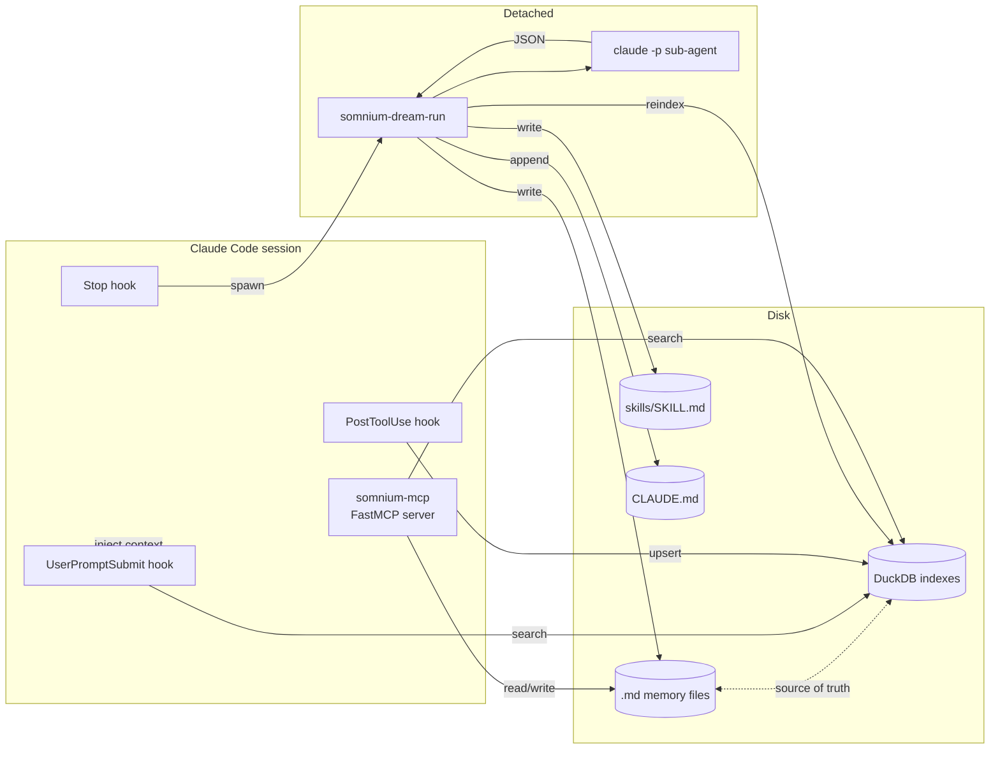

# Architecture

This document is for contributors. It covers how the package is laid
out, how the moving parts talk to each other, and the design decisions
that aren't obvious from reading the code.

## Package layout

```
somnium/
├── cli.py               # typer app — every user-facing command
├── config.py            # pydantic config + global/project merge
├── indexer.py           # markdown indexer orchestrator
├── mcp_server.py        # FastMCP server exposing the tools
├── templates/
│   └── config.toml      # default config copied on first init
│
├── storage/
│   ├── markdown.py      # frontmatter + H1/H2/H3 chunking
│   ├── vector.py        # DuckDB store, transactional upsert, search
│   └── scope.py         # Scope enum + normalization
│
├── embeddings/
│   └── voyage.py        # Voyage AI wrapper, batching, retry
│
├── code/
│   ├── chunker.py       # source-file line-group chunker
│   ├── walker.py        # repo walker with ignore rules
│   ├── indexer.py       # batch + single-file code index builder
│   └── semantic.py      # semantic query interface
│
├── hooks/
│   ├── _common.py       # stdin reader, logging, path routing
│   ├── install.py       # idempotent settings.json + MCP install
│   ├── post_tool_use.py # incremental memory + code reindex
│   ├── stop.py          # dream gate dispatcher
│   └── user_prompt_submit.py  # context injection
│
└── dream/
    ├── transcript.py    # parse Claude Code JSONL transcripts
    ├── gate.py          # heuristic decisioning
    ├── prompts.py       # system prompt + JSON schema
    ├── agent.py         # spawn claude -p sub-agent
    ├── router.py        # dispatch items to files
    ├── digest.py        # per-session markdown digest writer
    ├── runner.py        # full pipeline orchestration
    └── cli_runner.py    # detached runner entry point
```

## Data flow



## Key design decisions

**Markdown is the source of truth, the index is a cache.**
The DuckDB files can be deleted at any time and rebuilt by re-walking
the markdown directories. This is the single most important invariant
in the codebase. Any feature that wants to "store" something must
write to a `.md` file first and let the indexer pick it up.

**Hooks must use absolute paths.** Claude Code spawns hook commands
from a clean shell that does not include the user's venv on `PATH`.
Bare names like `somnium-hook-stop` silently fail with
`FileNotFoundError`. The installer in `somnium/hooks/install.py`
resolves every binary via `shutil.which()` then falls back to a
sibling of the current Python interpreter (which works for both venv
and pipx installs). Same applies to the MCP server registration.

**The MCP server is registered via `claude mcp add`, not via direct
edits to `settings.json`.** The canonical store for MCP servers is
`~/.claude.json`, not `~/.claude/settings.json`. The CLI handles scope
semantics, schema migration, and a startup health check. We only edit
`settings.json` for hooks.

**The Stop hook must return in <50 ms.** Claude Code blocks on the
hook synchronously. The full dream pipeline can take 30+ seconds, so
the Stop hook only runs the cheap heuristic gate, then dispatches the
real work as a **detached** subprocess (`subprocess.Popen(start_new_session=True)`).
The user sees Claude Code exit instantly, the dream agent finishes in
the background, and the new memories appear when they next look.

**Recursion is prevented by an env var, not by `--bare`.** The dream
sub-agent's own session would naturally end and trigger another Stop
hook → another dream → infinite loop. The runner sets
`SOMNIUM_DREAM_SUBAGENT=1` in the sub-process environment, and the
Stop hook checks for it before doing anything else. We don't use
`claude -p --bare` to disable hooks because `--bare` also disables
OAuth/keychain auth and breaks subscription users.

**Structured output lives at `envelope.structured_output`.** When
`claude -p --json-schema <schema>` is used, the validated payload is
in the `structured_output` field of the response envelope, not in
`result`. The latter is the human-readable text. We parse the former.

**Configurable scopes via deep merge.** The config loader is three
layers: packaged defaults → `~/.claude/somnium/config.toml` →
`<repo>/.claude/somnium/project.toml`. Each layer overrides only the
keys it specifies; everything else inherits. This is the same shape
Claude Code itself uses for `settings.json`.

## Adding a new MCP tool

1. Define the tool function in `somnium/mcp_server.py` and decorate it
   with `@mcp.tool()`. Type hints become the JSON schema; the docstring
   becomes the tool description Claude sees.
2. Return a JSON-serializable string. For complex payloads, dump
   `json.dumps(...)` so Claude gets formatted output.
3. Add a unit test that imports the module-level function (not the MCP
   wrapper) and asserts on the return value.
4. Restart any running Claude Code session to pick up the new tool.
   Hot reload is not supported by the MCP protocol.

## Adding a new hook

1. Create `somnium/hooks/<hook_name>.py` with a `main()` entry point.
   Use `read_event()` from `_common.py` to parse the stdin event.
2. Wrap the body in `try/except BaseException` and call `log_error`
   on failure. Hooks must always exit 0 to avoid blocking Claude Code.
3. Add the entry point to `pyproject.toml` under `[project.scripts]`.
4. Register the hook in `somnium/hooks/install.py` by appending to
   `DEFAULT_HOOKS` with a `HookSpec`. Use `_resolve_bin()` for the
   command path.
5. Add a unit test that pipes a fake event through `handle_event` and
   asserts on the result. Don't test `main()` directly — it calls
   `sys.exit()`.

## Testing

The test suite in `tests/` uses a fake embedder so it runs in about a
second and never touches the Voyage API. Most tests follow this
pattern:

```python
class _FakeEmbedder:
    def embed(self, texts, *, kind="text", input_type="document"):
        return EmbedResult(
            embeddings=[[1.0, 0.0, 0.0, 0.0] for _ in texts],
            model="fake",
            input_type=input_type,
        )
    def embed_query(self, text, *, kind="text"):
        return [1.0, 0.0, 0.0, 0.0]
    def model_for(self, kind):
        return "fake"

@pytest.fixture
def sandbox_cfg(tmp_path, monkeypatch):
    cfg = SomniumConfig()
    cfg.storage.global_root = str(tmp_path / "home")
    monkeypatch.setattr(indexer, "get_embedder", lambda c=None: _FakeEmbedder())
    return cfg
```

Tests use 4-dimension synthetic vectors. The `VectorStore` is
constructed with `embedding_dim=4` to match — patch the relevant
module's `VectorStore` class if you need this in a hook test.
