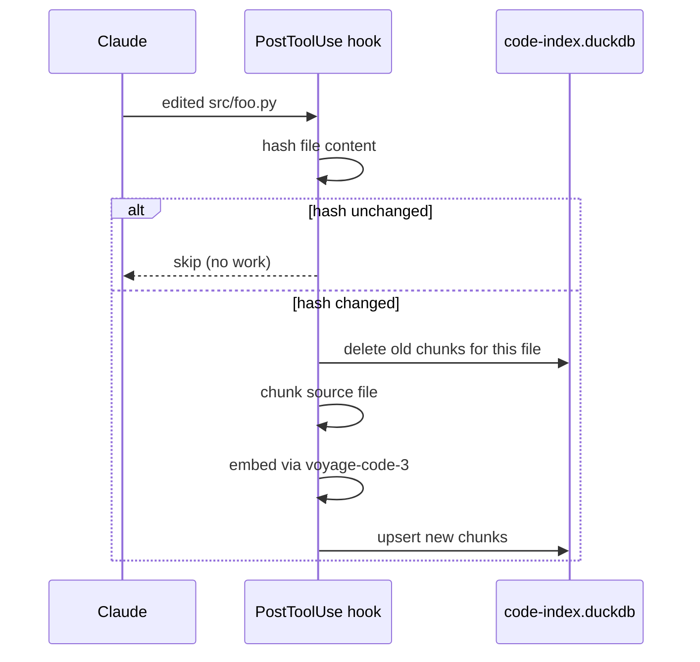

# Semantic code search

Somnium ships a per-project semantic code index that you can query
through the `code_search_semantic` MCP tool. It's a complement to grep
and Glob, not a replacement: when Claude knows the exact symbol it
should look up, ripgrep is still faster. When Claude only has a fuzzy
intent like *"where do we handle authentication"*, the semantic index
is what answers that question.

## Building the index

```bash
cd ~/code/my-project
somnium index --code
```

This walks the repo (respecting ignore rules), chunks each source file
into overlapping line groups, embeds them with `voyage-code-3`, and
stores the vectors in `<repo>/.claude/somnium/code-index.duckdb`.

The index is a single DuckDB file. Delete it and `somnium index --code`
rebuilds it from scratch — there's nothing else to back up.

## Incremental updates

You don't have to rerun `somnium index --code` after every edit. The
`PostToolUse` hook fires after each `Write`, `Edit`, `MultiEdit`, or
`NotebookEdit` tool call and reindexes only the touched file:



For files edited outside Claude (e.g. by you in another editor) the
hook obviously doesn't fire. Run `somnium index --code` again — it's
hash-based, so unchanged files are skipped and only the modified ones
are re-embedded.

## Chunking strategy

Source files are split into overlapping line groups. Defaults:

```toml
[code_search]
semantic_chunk_lines = 40       # 40 lines per chunk
```

Overlap is 25% (10 lines), so consecutive chunks share context and a
function that straddles a chunk boundary still gets embedded as a unit.

The chunker is language-agnostic. It doesn't parse the AST — that
keeps it fast and works for any file type. An AST-aware upgrade
(tree-sitter) is on the roadmap.

Files larger than 500KB are skipped to avoid wasting embeddings on
generated code, lockfiles, and other non-human artifacts.

## What gets indexed

Default file extensions (configurable):

```
.py .js .jsx .mjs .cjs .ts .tsx .go .rs .java .kt .scala
.c .cc .cpp .h .hpp .cs .rb .php .swift .m .mm
.sh .bash .sql .graphql .proto .yaml .toml .json
.html .css .scss .vue .svelte .lua .ex .erl .hs .ml
.clj .dart .r .jl .tf
```

Default ignore directories:

```
.git .hg .svn __pycache__ .venv venv env node_modules
.next .nuxt dist build target .gradle .idea .vscode
.cache .pytest_cache .mypy_cache .ruff_cache .claude
```

Override via config:

```toml
[code_search]
ignore = ["node_modules", ".venv", "dist", "build", "vendor", "third_party"]
```

## Querying

From inside a Claude Code session, the tool is available as
`code_search_semantic`. From the shell, use `somnium search` (which
queries the memory index by default — code requires the Python API):

```python
from somnium.config import load_config
from somnium.code.semantic import search_code

cfg = load_config()
hits = search_code("how do we authenticate API requests", top_k=5, config=cfg)
for h in hits:
    print(f"{h.score:.3f} {h.file_path}:{h.start_line}-{h.end_line}")
    print(h.text[:200])
```

Each hit comes back with:

- `file_path` — absolute path
- `start_line`, `end_line` — line range in the original file
- `language` — extension
- `score` — cosine similarity (higher is better)
- `text` — the raw code chunk

## Example results

Indexing the Somnium repo itself (44 files, 207 chunks):

```
$ somnium index --code
Indexing project code at /Users/me/code/claude-somnium
  code: seen 44 files, embedded 43, skipped 0,
        too-large 1, deleted 0, chunks upserted 207
```

Querying *"where is the dream gate heuristic"*:

```
0.584 [py] gate.py:31-70
0.573 [py] test_dream_gate.py:1-40
0.555 [py] gate.py:1-40
```

The top hit is the `decide()` function. The second is the test for it.
The third is the module docstring. All three are in the right place.

Querying *"how does the Voyage embedder batch requests"*:

```
0.598 [py] voyage.py:61-100      # the batching loop
0.586 [py] voyage.py:1-40        # docstring
0.528 [py] voyage.py:31-70       # model_for / __init__
```

## Cost

Indexing the Somnium repo (~6k lines of Python) cost roughly **$0.02**
in Voyage credits. Real-world projects with 100k+ lines tend to land
around **$0.30-$1.00** for the initial bootstrap, then almost nothing
after — incremental reindex only re-embeds files whose content hash
changed.

If you don't want to pay for code embeddings on a particular project,
just don't run `somnium index --code` there. The MCP tool degrades
gracefully and returns an empty list when no index exists.

## Limitations

- **No language understanding.** The chunker doesn't know what a
  function or class is. It splits by line count. This is fine for
  semantic intent queries but worse than LSP for "find all callers of
  X" type questions.
- **Single embedding model.** All chunks share the same `voyage-code-3`
  embedding space, regardless of language. This is fine in practice
  because Voyage was trained on multi-language code.
- **No reranker yet.** Top-K is pure cosine similarity. A second-stage
  reranker (e.g. Voyage's `rerank-2-lite`) would help on ambiguous
  queries; not implemented.
- **No AST indexing.** Splitting at function boundaries via tree-sitter
  is on the roadmap and would improve precision on small files.

For symbolic search (call graphs, definition lookup, references), pair
Somnium with [Serena](https://github.com/oraios/serena) — its LSP-based
MCP tools complement semantic search nicely.
