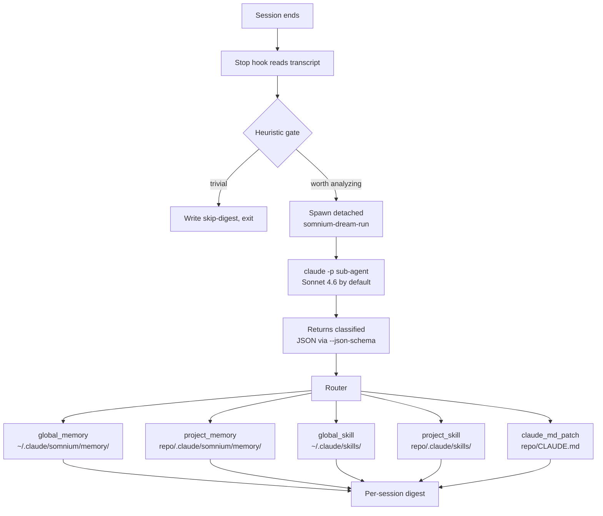

# Dream mode

The "dream mode" is what makes Somnium feel different from a passive
note store. Every time you finish a Claude Code session, a small
sub-agent reviews the conversation and decides what's worth keeping.
The result lands as real files on disk that you can `git diff` like
any other change.

## The full pipeline



## The gate

The Stop hook runs synchronously and must return in under a few hundred
milliseconds, so the gate is intentionally cheap. It only uses
heuristics — no LLM call:

1. If the session has fewer than `dream.gate.min_user_messages` user
   messages → **skip**.
2. If every user message matches one of `dream.gate.skip_patterns`
   (regex list) → **skip**. Defaults catch things like `commit this`,
   `push`, `run tests`, `fix the typo`.
3. If there were zero file writes AND fewer than six user messages
   → **skip** (probably a Q&A).
4. Otherwise → **run**.

When the gate decides to run, the hook spawns
`somnium-dream-run --transcript <path> --cwd <session-cwd>` as a
**detached subprocess** (`subprocess.Popen(start_new_session=True)`)
and returns immediately. Claude Code is never blocked by the LLM call.

## The sub-agent

`somnium-dream-run` calls `claude -p` with these flags:

```
claude -p <user_prompt>
  --model <dream.model>           # claude-sonnet-4-6 by default
  --append-system-prompt <dream system prompt>
  --output-format json
  --json-schema <schema>          # enforces structured output
  --disable-slash-commands
  --max-budget-usd 0.50
  --no-session-persistence
```

The user prompt is the full transcript rendered as compact markdown,
plus a context block listing existing memories and skills so the agent
knows what's already there and can choose to extend rather than
duplicate.

The system prompt instructs the agent to:

- Extract user corrections, confirmations of non-obvious choices,
  architecture decisions, project conventions, and workflow preferences.
- Skip transient debugging steps, error messages, file paths Claude can
  read on its own, one-off changes, and meta discussion.
- Emit atomic items (one idea per item) in one of these categories:
  `global_memory`, `project_memory`, `global_skill`, `project_skill`,
  `claude_md_patch`.
- Write each item with a "Why:" line explaining the user's stated
  reason and a "How to apply:" line so future Claude sessions can use
  the memory in context.

## Recursion safety

The sub-agent's own session ends when it returns the JSON, which means
*its* Stop hook would normally fire and trigger another dream run —
infinite loop. To prevent this, the runner sets
`SOMNIUM_DREAM_SUBAGENT=1` in the sub-process environment, and the Stop
hook checks for this variable at the very top:

```python
if os.environ.get("SOMNIUM_DREAM_SUBAGENT"):
    return {"skipped": "dream sub-agent context"}
```

We do **not** use `claude -p --bare` for this purpose because the
`--bare` flag also disables OAuth and breaks subscription auth.

## The router

The router takes each item from the agent's structured output and
writes it to the right location:

| Category | Destination |
|----------|-------------|
| `global_memory` | `~/.claude/somnium/memory/<date>-<slug>.md` |
| `project_memory` | `<repo>/.claude/somnium/memory/<date>-<slug>.md` |
| `global_skill` | `~/.claude/skills/<slug>/SKILL.md` |
| `project_skill` | `<repo>/.claude/skills/<slug>/SKILL.md` |
| `claude_md_patch` | Appended to `<repo>/CLAUDE.md` inside marker comments |

`claude_md_patch` writes are wrapped in HTML comments so subsequent
patches append next to each other instead of duplicating:

```markdown
<!-- somnium:dream:start -->
<!-- somnium auto-appended 2026-04-10T12:34:56 -->
## Python conventions

- All Python functions must have explicit type hints.
<!-- somnium:dream:end -->
```

After each successful write the router triggers an incremental reindex
through the same Voyage embedder used by the rest of the system, so the
new memory is searchable in the next session immediately.

Items that need a project root but were captured in a non-project
session are skipped with `reason: "no project detected"` — they show up
in the digest so you can review what was lost.

## The per-session digest

Every dream run, even a skipped one, writes a digest to:

```
~/.claude/somnium/dream/sessions/<timestamp>-<session-id>.md
```

The digest contains:

- Frontmatter with session ID, timestamp, cwd, gate decision, message
  counts, file write counts.
- The gate's decision and reason.
- The agent's `should_persist` flag, summary, and number of items
  returned.
- A table of items written, their categories, paths, and statuses.
- A `<details>` block with the raw agent output for debugging.

You can browse the digests as a chronological log of what Claude
learned across sessions. They're plain markdown, so you can grep them.

## Manual triggering

```bash
somnium dream                    # use the most recent transcript for the cwd
somnium dream -t /path/to.jsonl  # explicit transcript
somnium dream --force            # bypass the gate, always run
```

The `--force` flag is useful if you intentionally want to capture a
discussion the gate would normally skip.

## Cost

Typical dream run with the default `claude-sonnet-4-6`:

- ~21k cache_creation + 20k cache_read input tokens (mostly the system
  prompt + transcript)
- ~1k output tokens (the structured JSON)
- **~$0.08-0.12 per run**

To bring this down to fractions of a cent, set in your config:

```toml
[dream]
model = "claude-haiku-4-5"
```

Haiku is enough for most extraction tasks. Sonnet shines when the
session contained subtle preferences that need judgment ("did the user
imply a global rule or just a one-time fix?").

## Disabling

If you only want the MCP tools and the context injection without the
post-session loop, disable the dream entirely:

```toml
[dream]
enabled = false
```

The Stop hook still runs but exits immediately.
